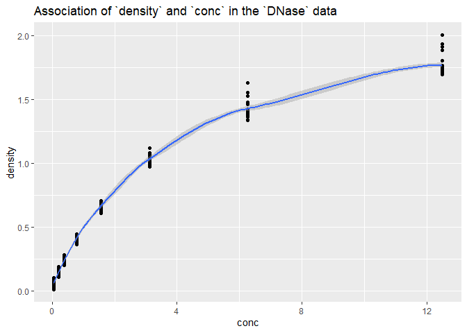

431 Deliverable A
================
Due **2018-08-30** at 2 PM. Last Edited 2019-08-16 23:27:23

## After Deadline Materials

1. The Answer Sketch is now available [in pdf](https://github.com/THOMASELOVE/2019-431/blob/master/DELIVERABLES/A/sketch_A.pdf) and [R Markdown](https://github.com/THOMASELOVE/2019-431/blob/master/DELIVERABLES/A/sketch_A.pdf).
2. Responses from Dr. Love on the HW A Survey Questions about 431 are at http://bit.ly/431-2019-hwa-survey-comments.
3. Grades on Homework A will be posted on 2019-09-05.

Deliverable A requires you to complete two activities. Completing each
activity is worth 15 points, for a total of 30.

# Activity 1. Interpreting a Visualization Built in R

Professor Love used R and the `tidyverse` to build the plot below using
the `DNase` data set from the `datasets` package automatically loaded by
R.

    `geom_smooth()` using method = 'loess' and formula 'y ~ x'

<!-- -->

Use the Help window in R to learn about the `DNase` data set, and in
particular, about the two variables displayed in the plot and their
scientific context. Then write a paragraph (no more than 100 words)
which explains what the plot indicates about the relationship between
the two variables, and (more generally) what you have learned about the
data (or science) from the plot.

**Note** If you cannot use R to learn about the data for some reason, try https://www.rdocumentation.org/packages/datasets/versions/3.6.1/topics/DNase.

Submit your paragraph (as either a Word or PDF file) to Canvas at
<https://canvas.case.edu/> in Deliverable A.

# Activity 2. Survey via Google Form

Please complete the survey provided at
<http://bit.ly/431-2019-deliverableA-survey>.

You’ll need to log into Google using your CWRU ID in order to access the
form. The survey asks about your attitudes toward statistics, as well as
for your opinion about the most important things you learned in the
first two sessions of 431. It should take less than 10 minutes for you
to complete the form.
